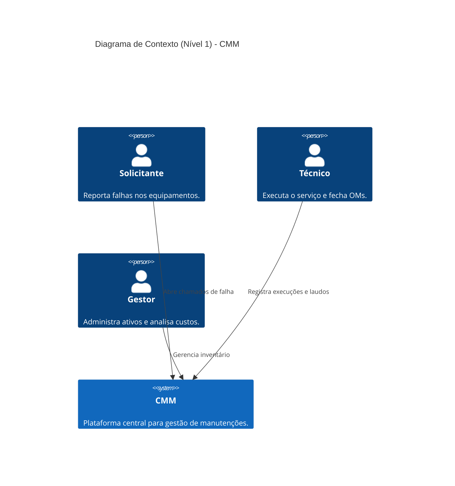
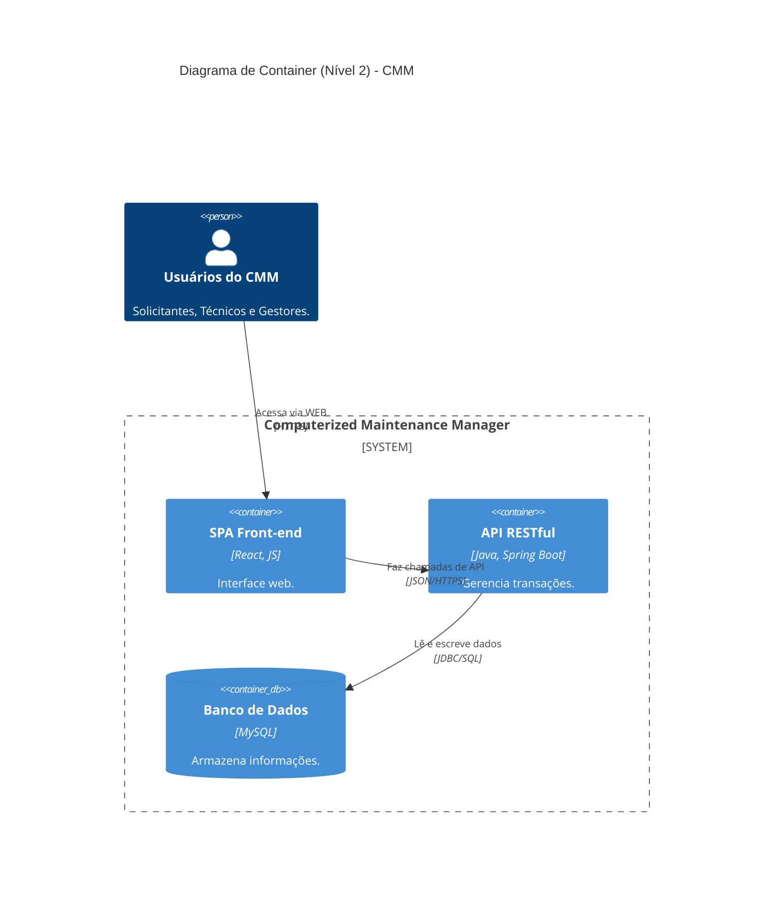
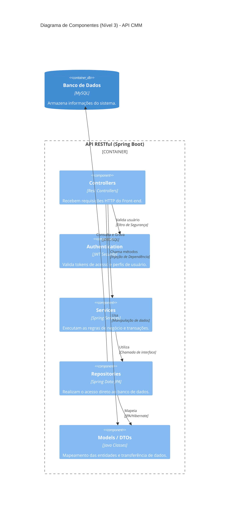

# ⚙️ CMM - Computerized Maintenance Manager

## Domínio do Problema e Escopo
Empresas que possuem infraestrutura física (prédios corporativos, indústrias, shoppings) lidam com uma grande quantidade de ativos, como elevadores, geradores, sistemas de ar-condicionado (HVAC) e maquinário industrial. O controle manual ou via planilhas dessas manutenções gera falta de visibilidade sobre o histórico de quebras, esquecimento de manutenções preventivas e dificuldade em calcular o custo total de operação (TCO).

O CMM é uma aplicação web focada em centralizar o cadastro de ativos e orquestrar as Ordens de Manutenção (preventivas e corretivas). O sistema possui um controle de acesso baseado em perfis: Gestores/Admins gerenciam todo o inventário e a equipe, Técnicos executam e laudam os serviços, e Solicitantes apenas abrem chamados de falha. O fluxo garante que a infraestrutura da empresa opere sem paradas inesperadas e com integridade no rastreamento de custos e tempo de inatividade (*downtime*).

## Stack Tecnológico e Infraestrutura
A arquitetura do sistema explora o modelo Client-Server utilizando tecnologias modernas para garantir alta disponibilidade, segurança e separação de responsabilidades.

### Front-end (Client-side)
A interface do usuário é uma Single-Page Application (SPA) construída com React. O ecossistema do React foi escolhido por facilitar a criação de dashboards interativos e pela sua alta reatividade, uma característica essencial para a camada de View, que precisa renderizar o status das máquinas e a fila de chamados em tempo real sem recarregar a página.

### Back-end (Server-side)
O núcleo lógico do sistema é centralizado em um back-end monolítico desenvolvido em Java com o framework Spring Boot. Esta escolha se justifica pela excelência do ecossistema Java em lidar com transações rígidas (garantindo as propriedades ACID) e pela facilidade na implementação de Inversão de Controle e Injeção de Dependência (IoC). O back-end é responsável por gerenciar a segurança (via JWT) e orquestrar o padrão de estados (State Pattern) do ciclo de vida das Ordens de Manutenção.

### Persistência de Dados
Para o armazenamento não volátil, optou-se pelo MySQL. A escolha por um banco de dados relacional justifica-se pela necessidade de modelar relações rígidas (Ativo -> Ordem de Manutenção -> Técnico) e garantir a integridade referencial absoluta durante o fechamento de um serviço e cálculo de custos.

### Infraestrutura e Qualidade
Para sustentar o ciclo de vida da aplicação, o ecossistema conta com as seguintes ferramentas:
* **Versionamento e Deploy:** Controle de código via Git com automação de CI/CD, garantindo entregas contínuas em ambiente de produção.
* **Documentação de API:** O contrato da API REST é mapeado e documentado utilizando o Swagger (OpenAPI).
* **Testes Automatizados:** Utilização do framework JUnit para aplicar o TDD (Test Driven Development) nas rotas e serviços críticos, como as transações de mudança de status de ativos e cálculos de horas/peças.

## Requisitos do Sistema

### Requisitos Funcionais (RF)
| ID | Descrição |
| :--- | :--- |
| **RF01** | O sistema deve possuir autenticação e autorização baseada em perfis (Solicitante, Técnico, Gestor) utilizando tokens JWT. |
| **RF02** | O sistema deve permitir que o Gestor realize o CRUD de Ativos, categorizando-os e definindo suas localizações. |
| **RF03** | O sistema deve permitir o cadastro de Técnicos, definindo suas especialidades (Mecânica, Elétrica, etc.). |
| **RF04** | O sistema deve permitir a abertura de Ordens de Manutenção (OMs), classificando-as obrigatoriamente como Preventiva ou Corretiva. |
| **RF05** | O sistema deve alterar automaticamente o status de um Ativo para "OFFLINE" assim que uma OM corretiva for aberta para ele. |
| **RF06** | O sistema deve permitir o gerenciamento de status da OM (Aberta -> Em Atendimento -> Aguardando Peça -> Concluída). |
| **RF07** | O sistema deve executar uma transação no fechamento da OM que calcule o custo total, mude a OM para "CONCLUÍDA" e retorne o Ativo para "ONLINE". |
| **RF08** | O sistema deve exibir dashboards com o status atualizado do inventário e histórico de custos. |

### Requisitos Não Funcionais (RNF)
| ID | Categoria | Descrição |
| :--- | :--- | :--- |
| **RNF01** | Interface | A interface do usuário deve ser construída como uma SPA utilizando React. |
| **RNF02** | Back-end | A API REST deve ser desenvolvida em Java com Spring Boot utilizando Injeção de Dependência. |
| **RNF03** | Banco de Dados | O armazenamento deve ser feito em MySQL para garantir integridade referencial e transacional. |
| **RNF04** | Segurança | O acesso às rotas da API deve ser protegido por autenticação via JWT (JSON Web Token). |
| **RNF05** | Testes | As regras de negócio da transação de fechamento de OM devem ser cobertas por testes automatizados em JUnit. |
| **RNF06** | Documentação | O contrato da API REST deve ser documentado utilizando Swagger. |
| **RNF07** | Integridade | Se houver erro no cálculo de custos durante o fechamento de uma OM, o banco de dados deve realizar um *rollback* da transação. |

## Casos de Uso Principais
Abaixo estão exemplos dos principais fluxos de interação entre os atores e o sistema:

* **UC01 - Gerenciar Ativos (CRUD):** **Ator:** Gestor. 
  * **Descrição:** O Gestor acessa o painel de administração e cadastra um novo equipamento (ex: Chiller 01), informando sua categoria, número de série e localização.
* **UC02 - Abertura de Chamado:** **Ator:** Solicitante. 
  * **Descrição:** O Solicitante reporta que um equipamento quebrou. O sistema gera uma OM Corretiva e imediatamente altera o status do ativo para "OFFLINE".
* **UC03 - Execução e Fechamento de OM:** **Ator:** Técnico. 
  * **Descrição:** O Técnico assume a OM, realiza o conserto e insere o laudo com horas trabalhadas e peças usadas. Ao finalizar, o sistema calcula os custos e retorna a máquina para o status "ONLINE".
* **UC04 - Pausa por Falta de Material:** **Ator:** Técnico. 
  * **Descrição:** O Técnico inicia o atendimento, mas percebe que falta uma peça. Ele altera o status do sistema para "Aguardando Peça", pausando o medidor de tempo de atendimento (*SLA*).

## Diagrama C4

### Nível 1: Diagrama de Contexto

### Nível 2: Diagrama de Containers

### Nível 3: Diagrama de Componentes (Back-end)

